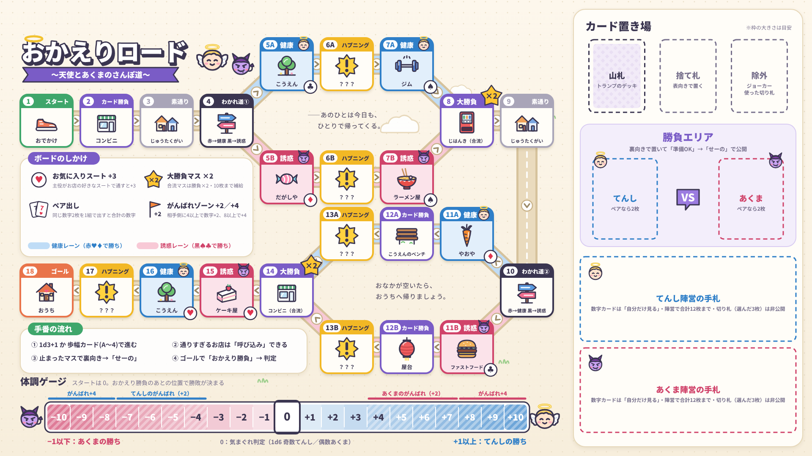

# おかえりロード 〜天使とあくまのさんぽ道〜

> *夕暮れの町を、あのひとは歩いて帰る。肩の上では、小さなてんしと小さなあくまが、今日もあのひとの体のことで言い争っている。*

CCFOLIA（[ccfolia.com](https://ccfolia.com/)）だけで完結する、トランプ＋ダイスすごろく形式のチーム対戦ボードゲームです。カードは CCFOLIA 標準の **「トランプのデッキ」** を使うので、現物のトランプもディーラー（進行役）も不要です。

NPCを「太らせたいあくま陣営」と「痩せて健康にしたいてんし陣営」に分かれて、分岐すごろくのルートと体調ゲージを奪い合います。カードはいつも **裏向きで置いて「せーの」で公開**。相手のマスにも「横やり」を入れられるので、どのマスでも読み合いが起こります。さらにボードには、お店ごとの「お気に入りスート（+3）」、合流マスの「大勝負（×2）」、同じ数字2枚の「ペア出し」、劣勢側の「がんばれゾーン（+2／+4）」といったしかけが描かれていて、どのカードをどこまで温存するかが勝負の分かれ目になります（使ったカードは補充されず、合流マスでまとめて補給）。手番では、ダイスの代わりに弱いカードを「歩幅カード」にして止まるマスを狙ったり、通りすぎるお店が「呼び込み」でNPCを引き止めたりできます。各陣営にはオリジナルの **切り札カード** が6枚ずつあり、そのうち選んだ3枚で「おまもり」「いいにおい」など1回だけの一発逆転を狙えます。最後は家の玄関先での **おかえり勝負** で決着です。

盤面やカードはポップですが、ルールブックのあちこちには少し不穏な **フレーバーテキスト** がひそんでいます。マスに止まったときの「[道中のひとこと](RULES.md#道中のひとことフレーバー)」や、ゴール後の「[エピローグ](RULES.md#エピローグゴール後の読み上げ)」を読み上げると、あのひとの散歩の、もうひとつの顔が見えてくるかもしれません。




- 対象人数：2〜6人（2チーム対抗。4人推奨）
- プレイ時間：約30〜40分
- 必要なもの：CCFOLIAのルーム、このリポジトリの画像素材

詳しいルールは [RULES.md](RULES.md)、初めての人への説明は [3分でわかる遊び方](RULES.md#3分でわかる遊び方インスト用まとめ) を参照してください。

## クイックスタート（CCFOLIAでの遊び方）

1. CCFOLIAでルームを作成し、プレイヤーを招待する。
2. [`assets/board_route_gauge.png`](assets/board_route_gauge.png) を **前景** に設定し、フィールドの大きさを **横80×縦45** にする（1920×1080pxの画像がぴったり収まる）。
3. [`assets/token_npc.png`](assets/token_npc.png) をNPCコマとしてマス「1 スタート」に、[`assets/token_gauge.png`](assets/token_gauge.png) をゲージコマとして体調ゲージの「0」に置く（お好みで [`token_angel.png`](assets/token_angel.png) / [`token_devil.png`](assets/token_devil.png) も）。
4. 盤面メニューの「カードデッキを追加」でトランプのデッキを追加し、ボード右上の「山札」の枠に置く。
5. 陣営を分け、各陣営の手札が合計10枚になるように「裏向きのまま引く」→「自分だけ見る」で手札を配る（ジョーカーは除外して引き直す）。
6. [`assets/cards/`](assets/cards/) の切り札カード（てんし・あくま各6枚。各陣営はそこから3枚を選んで使う）をスクリーンパネルとして置き、裏面に `*_back.png` を設定して、各陣営の手札置き場に非公開で並べる。
7. [`ccfolia/chat_palette.txt`](ccfolia/chat_palette.txt) を各プレイヤーのチャットパレットにコピーする。お好みで [`assets/quick_reference.png`](assets/quick_reference.png)（早見表）をスクリーンパネルとして置き、陣営ごとのプライベートチャットタブも作る。
8. [3分でわかる遊び方](RULES.md#3分でわかる遊び方インスト用まとめ) を読み上げて、プレイ開始。初めてなら [はじめての1戦（入門ルール）](RULES.md#はじめての1戦入門ルール) がおすすめです。

## リポジトリ構成

```
okaeri-road/
├── README.md               このファイル
├── RULES.md                ゲームルール本体
├── DESIGN_NOTES.md         デザインノート（テストプレイと名作ゲームとの比較の記録）
├── IMPROVEMENT_LOG.md      自動改善ループの作業記録
├── LICENSE                 ライセンス（CC0 1.0）
├── assets/                 CCFOLIA用の画像素材（*.svg は編集用ソース）
│   ├── board_route_gauge.png   ボード＋体調ゲージ＋カード置き場（前景用 1920×1080）
│   ├── quick_reference.png     インスト用早見表（スクリーンパネル用 1080×2446）
│   ├── token_npc.png           NPCコマ
│   ├── token_angel.png         てんし陣営コマ
│   ├── token_devil.png         あくま陣営コマ
│   ├── token_gauge.png         体調ゲージ用マーカー
│   ├── trump_cards_sheet.png   切り札カード12枚＋裏面の一覧
│   ├── cards/                  切り札カード（angel_*.png／devil_*.png、裏面 *_back.png。800×1200）
│   └── *.svg                   各画像の編集用SVGソース（tools/ で生成）
├── ccfolia/                CCFOLIA用のテキスト素材
│   └── chat_palette.txt        チャットパレット用テキスト
└── tools/                  素材の生成・テスト用スクリプト
    ├── build_assets.py         SVGを生成（色・配置・文言はここで管理）
    ├── art.py                  マスのイラスト・キャラクターのSVGパーツ
    ├── render_png.py           SVG→PNG書き出し（Playwright + Chromium）
    └── simulate.py             テストプレイ用の自動対戦シミュレータ（`python3 tools/simulate.py`）
```

素材を修正するときは `tools/build_assets.py` を編集し、`python3 tools/build_assets.py && python3 tools/render_png.py` で SVG と PNG を作り直してください（日本語フォント Noto Sans CJK JP が必要です。イラストはすべてSVGで描いているので絵文字フォントは不要です）。

## ライセンス

このゲームのルール・テキスト・画像素材は [CC0 1.0](https://creativecommons.org/publicdomain/zero/1.0/deed.ja)（パブリックドメイン相当）で公開します。自由に改変・再配布・商用利用していただいて構いません。
