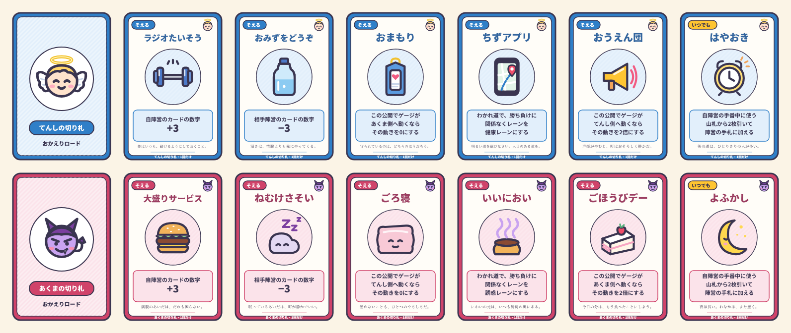

# おかえりロード 〜天使とあくまのさんぽ道〜 ルールブック v3

2〜6人向け・チーム戦トランプ＋ダイスすごろく／プレイ時間目安 約30〜40分

> *どなたさまも、どうぞまっすぐお帰りください。*
>
> *寄り道の多いかたは、とくに歓迎いたします。*
>
> ――道しるべの貼り紙

CCFOLIA（ココフォリア）の **標準機能（トランプのデッキ・ダイス・コマ・前景）だけ** で遊べます。現物のトランプもディーラー（進行役）も不要です。

## 目次

- [3分でわかる遊び方（インスト用まとめ）](#3分でわかる遊び方インスト用まとめ)
- [コンセプト](#コンセプト)
- [用意するもの](#用意するもの)
- [セットアップ](#セットアップ)
  - [人数別の編成例](#人数別の編成例)
- [手札とカード](#手札とカード)
- [マスの種類](#マスの種類)
  - [コース一覧](#コース一覧)
  - [わかれ道マスの通過ルール](#わかれ道マスの通過ルール)
  - [道中のひとこと（フレーバー）](#道中のひとことフレーバー)
- [ゲームの進め方](#ゲームの進め方)
  - [1ターンの流れ](#1ターンの流れ)
  - [カードの出し方（せーので公開）](#カードの出し方せーので公開)
  - [場面ごとのゲージの動き方](#場面ごとのゲージの動き方)
  - [プレイ例（最初の3ターン）](#プレイ例最初の3ターン)
- [ボードのしかけ](#ボードのしかけ)
  - [お気に入りスート（+3）](#お気に入りスート3)
  - [大勝負マス（×2）](#大勝負マス2)
  - [ペア出し](#ペア出し)
  - [がんばれゾーン（+2）](#がんばれゾーン2)
  - [計算の順番](#計算の順番)
- [切り札カード](#切り札カード)
- [カードの効果](#カードの効果)
  - [J「妨害」の扱い](#j妨害の扱い)
- [ハプニング表（1d6）](#ハプニング表1d6)
- [体調ゲージと勝敗判定](#体調ゲージと勝敗判定)
  - [エピローグ（ゴール後の読み上げ）](#エピローグゴール後の読み上げ)
- [上級ルール：スート効果（任意）](#上級ルールスート効果任意)
- [CCFOLIA運用メモ](#ccfolia運用メモ)
- [付録：トランプのデッキを使わない場合（ディーラー方式）](#付録トランプのデッキを使わない場合ディーラー方式)

## 3分でわかる遊び方（インスト用まとめ）

初めての人には、まずこの節だけ読み上げれば遊び始められます。細かい処理は必要になったときに本文を参照してください。

1. **目的**：NPCが家（マス18）に着いた瞬間の **体調ゲージ** が、+1以上なら **てんし陣営**、-1以下なら **あくま陣営** の勝ち。
2. **手番**：陣営が交互に `1d6` を振り、NPCコマを進める。止まったマスでイベントが起こる。
3. **カードの出し方は1つだけ**：出すカードを **裏向きで置き → 「せーの」で同時に表にする**。
   - 😇 **健康マス**：てんしがカードを出すとゲージが +（てんし側）に動く。あくまは **横やり** のカードを出して、その分を打ち消せる。
   - 😈 **誘惑マス**：その逆（あくまが出して -（あくま側）、てんしが横やり）。
   - ❓ **どちらでもマス**／🔀 **わかれ道マス**：両陣営が必ず1枚（またはペア）出す **カード勝負**。大きい方の陣営へ、差の分だけゲージが動く。わかれ道では勝ったカードの色でルートが決まる（赤＝健康レーン、黒＝誘惑レーン）。わかれ道だけは、止まったときに加えて **通過するときも** 勝負する（[わかれ道マスの通過ルール](#わかれ道マスの通過ルール)）。
4. **数字**：A=1、2〜10はそのまま、J=11・Q=12・K=13。J・Q・K には特殊効果がある（[カードの効果](#カードの効果)）。
5. **手札**：使ったらすぐ山札から同じ枚数引く。誰がカードを出すかは陣営で相談して決めてよい。
6. **ボードのしかけ**（すべてボードに描いてある）：
   - **お気に入りスート**：健康／誘惑マスのお店にはそれぞれ好きなスートがある。主役がそのスートで通すと **+3**。
   - **大勝負マス ×2**：合流マス（8・14）のカード勝負は、ゲージの動きが **2倍**。
   - **ペア出し**：同じ数字のカード2枚を1組で出すと、数字は **2枚の合計**。
   - **がんばれゾーン**：ゲージが相手側に6以上傾いている陣営は、出すカードの数字が **+2**。
7. **切り札カード**：各陣営は専用の切り札を6枚持ち、どれも **1回だけ** 使える。数字カードと一緒に裏向きで添えて、「せーの」で公開する（[切り札カード](#切り札カード)）。
8. **ゴールしたら**：勝敗を判定したあと、[エピローグ](#エピローグゴール後の読み上げ)を読み上げて終わる。

## コンセプト

とある NPC が、今日ものんびり散歩をして家に帰ろうとしています。

- **あくま陣営** は、この NPC を思いっきり **太らせたい**！
- **てんし陣営** は、この NPC を **痩せて健康**にしてあげたい！

NPC はすごろくを進みながら、途中の分かれ道でどちらのチームが主導権を握るかを競い合い、
出来事のたびにトランプを出し合って「体調ゲージ」を奪い合います。
帰宅した瞬間のゲージの状態で勝敗が決まります。

> 夕暮れの町を、あのひとは歩いて帰る。
>
> すれ違う人はみな、あのひとに会釈をする。あのひとも、ていねいに会釈を返す。
>
> 肩の上では、小さなてんしと小さなあくまが、今日もあのひとの体のことで言い争っている。
>
> ――ふたりがなぜ、そんなに必死なのか。あのひとは一度も、たずねたことがない。

ルールブックの各所にある引用（このような囲みの文）は、雰囲気づくりのための **フレーバーテキスト** です。ルールには影響しません。文中の「あのひと」は NPC のことです。読み上げるかどうかは自由ですが、ポップな盤面とのちぐはぐさも含めて楽しんでください。

v3では、①CCFOLIA標準の「トランプのデッキ」を使うことでディーラー（進行役）を不要にし、全員がプレイヤーとして参加できるようにしました。②健康マス／誘惑マスに相手陣営の「横やり」を追加し、どのマスでも読み合いが起こるようにしました。③「お気に入りスート」「大勝負マス」「ペア出し」「がんばれゾーン」の4つのしかけで、どのカードをどこまで温存するかという狙いが生まれるようにしました。④陣営ごとに6枚のオリジナル「切り札カード」を用意し、ここぞという場面の一発逆転を狙えるようにしました。

## 用意するもの

| 物 | 用途 |
|---|---|
| CCFOLIA のルーム | チャット・ダイス・コマ・カードの運用 |
| [assets/board_route_gauge.png](assets/board_route_gauge.png) | すごろくボード＋体調ゲージ＋カード置き場（CCFOLIAの **前景** に設定） |
| [assets/token_npc.png](assets/token_npc.png) | NPC コマ |
| [assets/token_gauge.png](assets/token_gauge.png) | 体調ゲージ用マーカーコマ |
| [assets/token_angel.png](assets/token_angel.png) / [assets/token_devil.png](assets/token_devil.png) | てんし・あくま陣営の目印コマ（任意） |
| [assets/cards/](assets/cards/) の切り札カード | てんし・あくま各6枚（`angel_*.png`／`devil_*.png`）と裏面（`*_back.png`）。CCFOLIAのスクリーンパネルとして置く（一覧：[trump_cards_sheet.png](assets/trump_cards_sheet.png)） |
| [assets/quick_reference.png](assets/quick_reference.png) | インスト用の早見表（スクリーンパネルとして置くと便利・任意） |
| CCFOLIA の「トランプのデッキ」 | 山札。盤面メニューの「カードデッキを追加」から追加する（54枚：ジョーカー2枚を含む） |

サイコロは CCFOLIA のチャット入力（`1d6` など）で振ります。

## セットアップ

1. **NPCを決める。** 名前・見た目（人間でも動物でもOK）・帰宅先を自由に決めてフレーバーづけする。
2. **陣営を分ける。** 全員を「てんし陣営」と「あくま陣営」にできるだけ均等に分ける（下の「[人数別の編成例](#人数別の編成例)」を参照）。
3. **手番順を決める。** てんし→あくま→てんし→あくま…と、陣営が交互になるように順番を決める（CCFOLIAのイニシアティブ表を使うと分かりやすい）。
4. **ボードを置く。** `board_route_gauge.png` を **前景** に設定し、フィールドの大きさを **横80×縦45**（1マス＝24px、1920×1080px）にする（詳しくは「[CCFOLIA運用メモ](#ccfolia運用メモ)」）。
5. **コマを置く。** NPCコマをマス「1 スタート」に、ゲージコマを体調ゲージの「0」に置く。
6. **山札を置く。** 「トランプのデッキ」を追加し、ボード右上の「山札」の枠に置く。
7. **初期手札を配る。** 各陣営の手札が **合計10枚** になるように、メンバーで分けて引く（1人陣営は10枚、2人陣営は5枚ずつ、3人陣営は4・3・3枚）。山札を右クリックして **「裏向きのまま引く」** で引き、自分の陣営の手札置き場に置いてから、各カードを右クリック→ **「自分だけ見る」** にする。
   - **ジョーカー** を引いたら（このとき以外も常に）、表にしてボードの「除外」枠に置き、代わりにもう1枚引く。ジョーカーはゲームで使わない。
8. **切り札を配る。** 各陣営の切り札6枚を、裏面を設定したスクリーンパネルとして自陣営の手札置き場に **裏向き（非公開）** で置く（作り方は「[CCFOLIA運用メモ](#ccfolia運用メモ)」）。切り札は陣営で共有し、手札の枚数には数えない。

### 人数別の編成例

| 人数 | 陣営の人数 | 1人あたりの初期手札 | 手番順の例 |
|---|---|---|---|
| 2人 | 1人 対 1人 | 10枚 | てんしA → あくまB → てんしA → … |
| 3人 | 2人 対 1人 | 5枚・5枚／10枚 | てんしA → あくまC → てんしB → あくまC → … |
| 4人 | 2人 対 2人 | 5枚ずつ | てんしA → あくまC → てんしB → あくまD → … |
| 5人 | 3人 対 2人 | 4・3・3枚／5枚ずつ | てんしA → あくまD → てんしB → あくまE → てんしC → あくまD → … |
| 6人 | 3人 対 3人 | 4・3・3枚 | てんしA → あくまD → てんしB → あくまE → てんしC → あくまF → … |

- 人数がそろわない場合、どちらの陣営を多くするかは相談またはダイスで決めてよい。
- 人数が違っても **陣営が交互に手番を行う** 点は変わらない。人数の少ない陣営は、自陣営の手番が来るたびにメンバーが順番に担当する。

## 手札とカード

- **手札は自分だけが見る。** 引いたカードは自分の陣営の手札置き場に裏向きで置き、「自分だけ見る」で確認する。他の人のカードを「自分だけ見る」で覗くのは禁止（マナー）。
- **陣営で相談してよい。** 陣営ごとにプライベートのチャットタブ（グループチャット）を作り、手札を教え合ったり、誰が出すかを相談したりしてよい。相談は1回1分程度を目安に。
- **数字**：A=1、2〜10はそのまま、J=11、Q=12、K=13。スート（♠♥♦♣）は、わかれ道マスのルート決定・[お気に入りスート](#お気に入りスート3)・上級ルールで使う。
- **使ったカード** は、公開されたまま捨て札置き場に置く。カードを使ったプレイヤーは、**すぐに使った枚数だけ** 山札から「裏向きのまま引く」で補充する（誰の手番かに関わらない）。
- **山札が無くなったら**、捨て札をすべて山札に戻す（捨て札を山札の上にドラッグして重ねる）。CCFOLIAの山札はランダムに引かれるので、シャッフルは不要。

## マスの種類

ボードは全18マスの一本道ですが、2箇所の「わかれ道」で健康レーン／誘惑レーンに分岐し、それぞれ3マスの後に合流します（実際の移動距離はどちらのレーンでも変わりません）。

| 記号 | マスの種類 | 起こること |
|---|---|---|
| 🚶 | スタート | 何もしない（ゲーム開始時のNPCコマの位置） |
| 🏠 | ゴール | 到達した瞬間にゲーム終了（勝敗判定へ） |
| 😇 | 健康マス | **てんし陣営** がカードを出せる。あくま陣営は **横やり** できる。お店ごとに **お気に入りスート** がある |
| 😈 | 誘惑マス | **あくま陣営** がカードを出せる。てんし陣営は **横やり** できる。お店ごとに **お気に入りスート** がある |
| ❓ | どちらでもマス | 両陣営が **カード勝負**（合流マス8・14は **大勝負 ×2**） |
| 🔀 | わかれ道マス | 両陣営が **カード勝負** し、勝ったカードの **色** でレーンが決まる |
| ❗ | ハプニングマス | 手番プレイヤーが `1d6` を振り、ハプニング表に従う |
| ➖ | 素通りマス | 何も起こらない |

### コース一覧

ボード画像（[assets/board_route_gauge.png](assets/board_route_gauge.png)）のマスの並びは次のとおりです。レーン内のマスは、番号の後ろに **A（健康レーン）／B（誘惑レーン）** を付けて呼びます。

| 区間 | マスの並び |
|---|---|
| 序盤 | 1 🚶スタート → 2 ❓ → 3 ➖ → 4 🔀わかれ道① |
| わかれ道① 健康レーン | 5A 😇こうえん♣ → 6A ❗ → 7A 😇ジム♠ |
| わかれ道① 誘惑レーン | 5B 😈だがしや♦ → 6B ❗ → 7B 😈ラーメン屋♠ |
| 中盤 | 8 ❓大勝負×2（合流）→ 9 ➖ → 10 🔀わかれ道② |
| わかれ道② 健康レーン | 11A 😇やおや♦ → 12A ❓ → 13A ❗ |
| わかれ道② 誘惑レーン | 11B 😈ファストフード♣ → 12B ❓ → 13B ❗ |
| 終盤 | 14 ❓大勝負×2（合流）→ 15 😈ケーキ屋♥ → 16 😇こうえん♥ → 17 ❗ → 18 🏠ゴール |

マス名の後ろのスートはそのお店の **お気に入りスート**、×2 は **大勝負マス** です（[ボードのしかけ](#ボードのしかけ)）。

### わかれ道マスの通過ルール

サイコロによる移動が、わかれ道マス（マス4・マス10）を **通過またはちょうど停止する** 場合、そのタイミングでレーン決定のカード勝負を行います。カード勝負でレーンが決まったら、残りの移動分はそのまま決まったレーンの中を進めてください。

- 例1：マス2から4進んだ場合、マス4でレーンを決定し、決まったレーンの5番目・6番目と進んで **6A（または6B）** に止まります。
- 例2：マス3から6進んだ場合、マス4でレーンを決定し、レーンの5〜7番目を通って合流マス8へ戻り、**マス9** に止まります（途中で通過したマスの効果は発生しません）。

わかれ道マスに **ちょうど止まった** 場合は、その場でカード勝負を行ってレーンを決め、NPCコマはわかれ道マスに置いたまま手番を終えます。次の手番は決まったレーンへ進みます（出発時に改めて勝負は行いません）。決まったレーンを忘れないよう、手番プレイヤーはチャットに「健康レーンに決定」と書き残してください。

サイコロ以外の **1マスの追加移動**（Q「先導」や上級ルールの ♦）でわかれ道マスに入った場合も、**ちょうど止まった** 場合と同じく、その場でカード勝負を行ってレーンを決め、NPCコマはわかれ道マスに置いたまま手番を終えます。

- 例：上級ルールで、マス2（❓）のカード勝負にてんし陣営が ♦Q で勝った場合、先導で **マス3（➖）**、続けて ♦ で **マス4（わかれ道①）** に進み、その場でレーン決定のカード勝負を行う。

勝ったカードが Q「先導」だった場合の1マス追加移動は、次のタイミングで行います。

- **通過中** の勝負：サイコロの残り移動を終え、止まったマスの処理を済ませた **後** に1マス進む。
  - 例3：マス3から2進み、マス4の勝負でてんし陣営が ♥Q で勝った場合、健康レーンに決まって残り1マスで **5A（😇）** に止まり、健康マスの処理を行う。その後、先導で **6A（❗）** へ進み、ハプニングも処理する。
- **ちょうど止まった** 勝負：レーンを決めた後、そのレーンの最初のマス（5A／5B、または 11A／11B）へ1マス進み、そのマスを処理して手番を終える。

### 道中のひとこと（フレーバー）

NPCコマがマスに止まったら、手番プレイヤーがそのマスのひとことを読み上げてもかまいません（任意。ルールには影響しません）。ハプニングマスのひとことは、[ハプニング表](#ハプニング表1d6)の出目ごとに用意しています。

| マス | ひとこと |
|---|---|
| 1 おでかけ | 夕暮れ。あのひとは今日も、決まった時刻に家を出る。 |
| 2 コンビニ | 店員の名札を、あのひとはいつも小さく声に出して読む。 |
| 3 じゅうたくがい | 明かりのついた窓を、ひとつ、ふたつと数えていく。 |
| 4 わかれ道① | どちらの道を選んでも、帰る家はひとつしかない。 |
| 5A こうえん | 走る人たちの息が白い。よく締まった、いい脚だ。 |
| 7A ジム | ガラス越しに汗を流す人々を、あのひとは長いこと眺めていた。 |
| 5B だがしや | おばあさんは、あのひとにだけ飴をひとつ多くくれる。昔からの顔なじみだ。 |
| 7B ラーメン屋 | 骨を煮込む匂い。あのひとは目を細める。「いい出汁だ」 |
| 8 じはんき | 自販機の明かりの下では、だれの顔も青白く見える。 |
| 9 じゅうたくがい | 先週まで表札のあった家が、空き家になっていた。 |
| 10 わかれ道② | 振り返っても、ついてくる足音はない。 |
| 11A やおや | 「たまには野菜もね」と店主が笑う。あのひとも笑う。歯を見せずに。 |
| 12A こうえんのベンチ | ベンチで休む老人が、あのひとの影の長さに首をかしげる。 |
| 11B ファストフード | 「ご一緒にいかがですか」。あのひとは店員の顔をじっと見つめてから、断った。 |
| 12B 屋台 | 串に刺さった肉が何の肉か、屋台の主人は決して言わない。あのひとも聞かない。 |
| 14 コンビニ | 二度目のコンビニ。さっきとは別の店員が、レジに立っている。 |
| 15 ケーキ屋 | 甘いものは別腹だと、あのひとは言う。では、本腹には何が入るのだろう。 |
| 16 こうえん | 夕暮れの公園に、もう人影はない。ブランコだけが揺れている。 |
| 18 おうち | 「ただいま」。返事はない。いつものことだ。 |

## ゲームの進め方

### 1ターンの流れ

1. **移動**：手番プレイヤーが `1d6` を振り、出た目の数だけ NPC コマを進める。ゴールを通り過ぎる場合はゴールで止まる。
2. **マス処理**：**止まったマス** の種類に応じて処理する。通過しただけのマスは何も起こらない（例外：わかれ道マスは通過時にもカード勝負を行う）。
3. **後片付け**：使ったカードを捨て札置き場に置き、使った人は補充する。ゲージコマは手番プレイヤーが動かす。
4. 反対陣営の次のプレイヤーに手番が移る。

### カードの出し方（せーので公開）

カードを出す場面は、すべて次の手順で行います。

1. **出すかどうか・どのカードを出すか** を陣営で決める（陣営チャットで相談してよい）。
2. 出す人は、ボードの **「勝負エリア」の自陣営の枠** にカードを **裏向きのまま** 置く（[切り札](#切り札カード)を使うなら一緒に添える）。出さない（パスする）場合は何も置かない。どちらの場合も、陣営の代表がチャットで **「準備OK」** とだけ言う（パスするかどうかは、この時点では言わない）。
3. 両陣営の「準備OK」がそろったら、手番プレイヤーが「せーの」と合図し、置かれたカードを **右クリック→「全体に公開する」** で表にする。カードを置いていない陣営は、このとき「パス」と宣言する。
4. 下の「[場面ごとのゲージの動き方](#場面ごとのゲージの動き方)」に従ってゲージを動かし、**勝った（通った）カード** の特殊効果を処理する。
5. 公開したカードはすべて捨て札置き場へ（効果中の目印として置いておく J（上級ルールの ♣ も）は解除時に移す。[J「妨害」の扱い](#j妨害の扱い) 参照）。出した人はそれぞれ、**使った枚数だけ** 補充する（[ペア出し](#ペア出し)で1人が2枚出したなら2枚。切り札は補充しない）。

置いた後でカードを差し替えたり、相手のカードを見てから置いたりするのは禁止です。

- パスを先に言わないのは、相手に「横やりが来ない」「主役が出さない」と知られないようにするためです。
- 例：健康マスで、あくまが横やりに ♠5 を置いたが、てんしはパスした → 公開すると主役のカードが無いので **ゲージは動かない**。置いた ♠5 は公開されたので捨て札になり、あくまは1枚補充する。

### 場面ごとのゲージの動き方

| 場面 | カードを出す陣営 | パス | ゲージの動き |
|---|---|---|---|
| 😇 健康マス | **主役**：てんし／**横やり**：あくま | どちらも可 | 主役の数字 − 横やりの数字 だけ **てんし側（＋）** へ（0未満なら0） |
| 😈 誘惑マス | **主役**：あくま／**横やり**：てんし | どちらも可 | 主役の数字 − 横やりの数字 だけ **あくま側（−）** へ（0未満なら0） |
| ❓ どちらでもマス／🔀 わかれ道マス | 両陣営とも1枚（またはペア） | **不可**（手札0枚なら数字0） | 数字の大きい陣営の側へ、**差** だけ動く（大勝負マスは2倍） |

- **健康マス／誘惑マス**：主役のカードの数字が横やりより **大きい** とき、主役のカードは **通った** ことになり、J・Q・K の特殊効果が発生する。横やりが無ければ（パスなら）、主役のカードはそのまま通る。横やりのカードは数字を打ち消すだけで、特殊効果は発生しない。
- **カード勝負**：数字の大きい方が **勝ち**。勝ったカードだけ特殊効果が発生する。同数なら引き分けで、ゲージは動かず、どちらの特殊効果も発生しない（わかれ道では手番プレイヤーが `1d2` を振り、奇数＝健康レーン、偶数＝誘惑レーン）。
- **わかれ道マス**：勝ったカードのスートの色でレーンが決まる。**赤（♥♦）＝健康レーン、黒（♠♣）＝誘惑レーン**。

例：

- 健康マスで、てんしが ♥9、あくまが横やりで ♠4 → 9−4＝5 で **ゲージ+5**。
- 誘惑マスで、あくまが ♦Q、てんしが横やりで ♣K → 12−13 は0未満なので **ゲージは動かない**。Q は通っていないので「先導」も起こらない。
- どちらでもマスで、てんしが ♥K、あくまが ♠8 → てんしの勝ち。差5＋大逆転3で **ゲージ+8**。

### プレイ例（最初の3ターン）

4人（てんしA・てんしB 対 あくまC・あくまD）、手番順 A → C → B → D …、上級ルールなしの場合の流れの例です。

1. **てんしAの手番**：`1d6` で1が出て、NPCコマは **マス2（❓ どちらでも）** に止まる。カード勝負なので両陣営とも1枚出す。陣営チャットで相談し、てんしは A が ♥8、あくまは D が ♠5 を勝負エリアに裏向きで置く。A の「せーの」で公開し、てんしの勝ち（差3）で **ゲージ+3**。A と D はそれぞれ1枚補充する。
2. **あくまCの手番**：`1d6` で4が出る。2マス目でわかれ道①（マス4）を通過するので、そこでカード勝負。B が ♦6、C が ♣9 を出し、あくまの勝ち（差3）で **ゲージ0**、黒のスートなので誘惑レーンに決まる。残り2マスで **6B（❗）** に止まり、C が `1d6` を振って3「あくまのささやき」で **ゲージ−2**。
3. **てんしBの手番**：`1d6` で1が出て **7B（😈 ラーメン屋・お気に入り♠）** に止まる。あくまは主役として D が ♠10 を、てんしは横やりとして A が ♥7 を裏向きで置く。公開して 10−7＝3、♠ はラーメン屋のお気に入りなので +3 で **ゲージ−8**。横やりが無ければ −15（端の −10）まで動いていたところを、てんしは ♥7 を使って食い止めた。
4. **あくまDの手番**：ゲージは −8 で、てんし側から見て相手側に6以上傾いているので、てんし陣営は **がんばれゾーン**（出すカードの数字 +2）に入っている。次の合流マス8は **大勝負 ×2** なので、てんしは強いカードやペアを温存しておきたい……といった狙いが生まれる。

## ボードのしかけ

ボードに描かれている4つのしかけです。どれも「どのカードをいつ使うか」の狙いを作るためのもので、基本ルールとしていつも使います。

### お気に入りスート（+3）

- 健康マス・誘惑マスのお店には、それぞれ **お気に入りスート** があります（ボードのマスの右下に表示）。
- 主役のカードが **通った** とき、そのカードがお店のお気に入りスートなら、ゲージの動きに **さらに +3**（主役の陣営側へ）を加えます。横やりのカードのスートは関係ありません。
- 各陣営のマスに ♠♥♦♣ が1つずつ割り当てられています。終盤の 15 ケーキ屋・16 こうえん はどちらも ♥ なので、♥ を最後まで温存するか、早めに使うかが悩みどころです。

| 陣営 | お気に入りスート |
|---|---|
| 😇 健康マス | 5A こうえん ♣／7A ジム ♠／11A やおや ♦／16 こうえん ♥ |
| 😈 誘惑マス | 5B だがしや ♦／7B ラーメン屋 ♠／11B ファストフード ♣／15 ケーキ屋 ♥ |

- 例：16 こうえん（♥）で、てんしが ♥8、あくまの横やりが ♣5 → 8−5＝3、お気に入り +3 で **ゲージ+6**。

### 大勝負マス（×2）

- 合流マスの **8** と **14**（どちらでもマス）は **大勝負マス** です。カード勝負の結果、ゲージの動き（差＋K の大逆転などすべて）を **2倍** にします。
- 例：マス14で、てんしが ♦9、あくまが ♣5 → 差4 の2倍で **ゲージ+8**。

### ペア出し

- **同じ数字のカード2枚** を、1組として同時に出せます（主役・横やり・カード勝負のどれでも）。数字は **2枚の合計** です（例：7のペアは14 で、K の13より強い）。
- 2枚とも勝負エリアに裏向きで置き、通常どおり「せーの」で公開します。2枚は **同じ陣営なら別々の人の手札から1枚ずつ** 出してもかまいません。使った人は使った枚数だけ補充します。
- J・Q・K のペアの特殊効果は **1回分だけ** 発生します（K のペアなら 26＋3）。お気に入りスートは、2枚のどちらかが一致すれば +3（1回分）。
- わかれ道マスでペアが勝った場合、レーンは **出した陣営が2枚のどちらかの色を選んで** 決めます。
- 妨害・♣ の半減は、ペアの合計にかかります（妨害なら合計が0）。

### がんばれゾーン（+2）

- ゲージが **相手陣営の側に6以上** 傾いている陣営（てんしならゲージ −6〜−10、あくまならゲージ +6〜+10 のとき）は、公開するカードの数字に **+2** します（主役・横やり・カード勝負のどれでも。ペアは合計に+2を1回）。
- ボードの体調ゲージの両端に、それぞれの陣営のがんばれゾーンが描かれています。
- がんばれゾーンに入っているかどうかは、**「せーの」で公開した時点のゲージ**（その公開でゲージを動かす前）で判定します。同じ手番の中で先にゲージが動いていれば（わかれ道の通過時の勝負・ハプニング・Q「先導」の先のマスなど）、動いた後のゲージで判定します。
  - 例：ゲージ −3 で、あくまの手番にマス3から2進む。わかれ道①（マス4）の勝負は公開時のゲージが −3 なので +2 は無し。あくまが ♠9、てんしが ♥6 で勝ち、差3で **ゲージ −6**、誘惑レーンに決まる。残り1マスで 5B（😈 だがしや）に止まると、この公開時のゲージは −6 なので、てんしの横やりのカードは **+2** される。
- 例：ゲージ −7 のとき、どちらでもマスでてんしが ♥8、あくまが ♠9 → てんしは 8＋2＝10 でてんしの勝ち、**ゲージ+1**（−6 になる）。

### 計算の順番

迷ったときは、次の順に計算します。

1. **数字を決める**：カードの数字（ペアは合計）→ 妨害なら0、♣ の半減なら半分（切り上げ）→ がんばれゾーンなら +2 → 切り札の +3／−3（0未満は0）。
2. **差を出す**：健康／誘惑マスは「主役 − 横やり」（0未満は0）、カード勝負は「大きい方 − 小さい方」。
3. **ボーナスを足す**（勝った／通ったカードだけ）：K の大逆転 +3、お気に入りスート +3。
4. **2倍にする**：大勝負マス、または切り札「おうえん団」「ごほうびデー」（重なっても2倍まで）。
5. **切り札「おまもり」「ごろ寝」** が使われていれば、その陣営に不利な向きの動きを0にする。
6. ゲージを動かす（-10〜+10 の範囲で止まる）。

## 切り札カード

てんし陣営とあくま陣営は、それぞれ専用の **切り札カード** を6枚ずつ持っています。どれも1ゲームに **1回だけ** 使える、ここぞという場面のための一枚です（画像：[assets/cards/](assets/cards/)、一覧：[trump_cards_sheet.png](assets/trump_cards_sheet.png)）。

| てんしの切り札 | あくまの切り札 | 使い方 | 効果 |
|---|---|---|---|
| ラジオたいそう | 大盛りサービス | そえる | 自陣営のカードの数字 **+3** |
| おみずをどうぞ | ねむけさそい | そえる | 相手陣営のカードの数字 **−3**（0未満にはならない） |
| おまもり | ごろ寝 | そえる | この公開でゲージが **相手側へ動くなら、その動きを0** にする |
| ちずアプリ | いいにおい | そえる | わかれ道マスで、勝ち負けに関係なく **レーンを自陣営の側**（てんし＝健康、あくま＝誘惑）にする（ゲージは通常どおり） |
| おうえん団 | ごほうびデー | そえる | この公開でゲージが **自陣営側へ動くなら、その動きを2倍** にする |
| はやおき | よふかし | いつでも | 自陣営の手番中に公開して使い、山札から **2枚引いて** 陣営の誰かの手札に加える |

- **そえる**：カードを出す場面（健康マス・誘惑マス・カード勝負）で、数字カードと一緒に勝負エリアの自陣営の枠に裏向きで置き、「せーの」で一緒に公開する。**1回の公開につき1陣営1枚まで**。数字カードを置かずに（パスして）切り札だけ添えてもよい（例：健康マスで、あくまが「ねむけさそい」だけを添えて、てんしの主役を −3 する）。
- **いつでも**：自陣営のプレイヤーの手番中なら、カードを出す場面の途中（準備〜公開の処理）以外のいつでも、表にして使える。
- 使った切り札は、表のまま **除外** 枠に置く（捨て札にも山札にも戻さない）。切り札は補充しない。
- 切り札は数字カードではないので、J「妨害」や ♣ の半減の対象にならず、「妨害」の解除にも数えない。
- **+3／−3 の切り札**（ラジオたいそう・大盛りサービス／おみずをどうぞ・ねむけさそい）は、[計算の順番](#計算の順番)の1のとおり、妨害・半減・がんばれゾーンを計算した後の数字に加減する。ペアなら合計に1回だけ。対象の陣営が数字カードを公開していない（パスした、または手札0枚で数字0とした）場合は何も起こらない。切り札だけで主役のカードの代わりにしたり、パスした相手を −3 したりはできない。
  - 例：健康マスで、てんしはパスし、あくまは横やりの代わりに「ねむけさそい」だけを添えていた → 主役のカードが無いので −3 は何も起こらず、**ゲージは動かない**。それでも「ねむけさそい」は公開したので使用済みとして除外枠へ置く。
- 両陣営が同じ公開で切り札を使った場合は、[計算の順番](#計算の順番)に従ってまとめて処理する。わかれ道で「ちずアプリ」と「いいにおい」が同時に使われたときは打ち消し合い、通常どおり勝ったカードの色でレーンを決める。
- 「おまもり」「ごろ寝」が0にするのは、その公開でのゲージの動きだけ。Q「先導」や J「妨害」などの効果は通常どおり発生する。
- 例：マス14（大勝負）で、てんしが ♥9＋「おうえん団」、あくまが ♠6＋「ごろ寝」を出した → てんしの勝ちで差3、大勝負と「おうえん団」は重なっても2倍までなので6。しかし「ごろ寝」でてんし側への動きは0になり、**ゲージは動かない**。読み合いの末、両陣営とも切り札を1枚ずつ失った。

## カードの効果

| カード | 数字 | 特殊効果（勝った／通ったときだけ） |
|---|---|---|
| A〜10 | 1〜10 | なし |
| J | 11 | **妨害**：相手陣営が次に公開するカード1枚を **数字0・効果なし** にする |
| Q | 12 | **先導**：NPCコマをさらに1マス進める（進んだ先のマスも処理する） |
| K | 13 | **大逆転**：ゲージの動きに、さらに **+3**（自陣営側へ）を加える |

体調ゲージは -10〜+10 の範囲までしか動きません。端に達したら、それ以上は動かず留まります。

### J「妨害」の扱い

- 妨害は、相手陣営が **次にカードを公開するまで** 続く（ターンをまたいでも、相手陣営がパスしても消えない）。手番プレイヤーは「あくま陣営に妨害中」のようにチャットで宣言し、ゲージコマの横に目印として妨害したJを置いておくとよい。
- 目印にしたJは、妨害が解除されたときに捨て札置き場へ移す（それまでは山札にも捨て札にも含めない）。J を出した人の補充は、目印にするかどうかに関わらず **公開したときにすぐ** 行う。
- 相手陣営が次に公開したカード（主役・横やり・カード勝負のどれでも）は **数字0** として扱い、特殊効果も発生しない。その時点で妨害は解除される。
- 例：てんし陣営が健康マスで J を通した後、どちらでもマスでてんしが ♥4、あくまが ♠9 を出した → ♠9 は0扱いでてんしの勝ち、**ゲージ+4**。

## ハプニング表（1d6）

| 出目 | 名称 | 効果 | ひとこと（フレーバー） |
|---|---|---|---|
| 1 | 忘れ物ニュース | 変化なし（NPCのちょっとした小話を手番プレイヤーが語ってもよい） | 町内放送が落とし物を告げる。「黒い手さげかばん……持ち主の方は、まだ見つかっていません」 |
| 2 | てんし急接近 | 体調ゲージが てんし側に +2 | てんしが耳もとでささやく。「今日はもう、だれにも近づかないで」 |
| 3 | あくまのささやき | 体調ゲージが あくま側に -2 | あくまが耳もとでささやく。「いいじゃないか、ひとくちくらい」 |
| 4 | 近道発見 | NPCコマがさらに1マス進む。進んだ先のマスも処理する | 塀のすき間の細い道。ここを通るのは、あのひとと野良猫だけだ。 |
| 5 | 寄り道 | NPCコマが1マス戻る。戻った先のマスは処理しない | さっきすれ違った人の行き先が、急に気になった。 |
| 6 | 気分屋 | 手番プレイヤーは手札を1枚、裏向きのまま捨て札にし、1枚引く（手札交換。カードの「公開」ではないので妨害などには関係しない） | ポケットの中身を入れ替える。何を捨てたのかは、だれにも見せない。 |

- 例：6A（❗）で出目5「寄り道」が出た場合、NPCコマは5Aに戻るが、健康マスの処理は行わない。レーン内で戻るだけなので、選ばれたレーンは変わらない。
- 手札が0枚のときに「気分屋」が出た場合は、何も起こらない。

## 体調ゲージと勝敗判定

体調ゲージは **-10（あくま側）〜 +10（てんし側）** の21段階で、ゲーム開始時は「0」。

NPCコマがゴールマスに到達した瞬間、ゲームは即座に終了し、その時点の体調ゲージで勝敗を判定する。

- ゲージが **+1以上** → **てんし陣営の勝利**（NPCは健康的に帰宅した！）
- ゲージが **-1以下** → **あくま陣営の勝利**（NPCはお腹いっぱいで帰宅した！）
- ゲージが **ちょうど0** → 「気まぐれ判定」：手番プレイヤーが `1d6` を振り、**奇数ならてんし陣営、偶数ならあくま陣営** の勝利。

### エピローグ（ゴール後の読み上げ）

勝敗が決まったら、ゴールした手番プレイヤーが、勝った陣営のエピローグと「むすび」を読み上げてゲームを終えます（任意。ルールには影響しません）。気まぐれ判定になったときは、ダイスを振る前に「気まぐれ判定のとき」を読み上げます。

**気まぐれ判定のとき**

> どちらとも言えない一日だった。
>
> あのひとは玄関で立ち止まり、肩の上のふたりを、しばらく黙って見つめていた。

**てんし陣営の勝利**

> あのひとは軽い足どりで帰ってきた。今日はほとんど何も食べていない。体は軽く、よく眠れそうだ。
>
> てんしは満足そうにうなずく。これで明日も、あのひとは遠くまで歩いていける。
>
> ――窓の外には、まだいくつかの家に明かりがついている。あのひとはそれをひとつずつ数えてから、カーテンを閉めた。

**あくま陣営の勝利**

> あのひとはお腹いっぱいで帰ってきた。ソファに沈みこみ、満ち足りた息をつく。
>
> あくまはにやりと笑う。これでしばらく、あのひとは動かないだろう。
>
> ――今日立ち寄ったお店の人たちの顔を、あのひとはひとりずつ思い出していた。みんな、とてもよくしてくれた。明日もあのお店が開いているかどうかは、だれも知らない。

**むすび（どちらの勝利でも）**

> 玄関の明かりが消える。
>
> この家で「おかえり」と言う声を、もう長いこと、だれも聞いていない。
>
> てんしとあくまは今夜も、あのひとの肩の上で眠る。自分たちがなぜここにいるのかを、思い出さないようにしながら。

## 上級ルール：スート効果（任意）

慣れてきたら、勝った／通ったカードのスートに応じて追加効果を発生させます（健康マス・誘惑マス・どちらでもマスで適用）。

| スート | 追加効果 |
|---|---|
| ♠ スペード | なし（その代わり、黒なのでわかれ道では誘惑レーン） |
| ♥ ハート | 出した人が、補充とは別に山札から **もう1枚** 引く |
| ♦ ダイヤ | 効果の処理後、NPCコマがさらに1マス進む（進んだ先のマスも処理する） |
| ♣ クラブ | 相手陣営が次に公開するカード1枚の数字を **半分（端数切り上げ）** にする |

- **わかれ道マス** では、スートはレーン決定にだけ使い、その勝負で出したカードの追加効果は発生しない。ただし、それより前にかかっていた ♣ の半減（や J の妨害）は、わかれ道マスで公開したカードにも適用され、そこで解除される。
- **負けたカード・横やりのカード・妨害で0になったカード** のスート効果は発生しない。
- **♣ の半減** は J「妨害」と同じく、相手陣営が次にカードを公開するまで続く。妨害と半減が同時にかかっている場合は妨害が優先し（数字0）、両方とも解除される。J と同じく、半減させた ♣ のカードを目印としてゲージコマの横に置き、解除時に捨て札へ移してよい。
  - 例：あくまが誘惑マスで ♣6 を通した後、てんしが次の健康マスで ♥K を出し、あくまは横やりしなかった → K は 13 の半分で7、大逆転+3 で **ゲージ+10**。
- **♦Q** が勝った／通った場合は、NPCコマが合計2マス進む。まず Q「先導」で1マス進んでそのマスを処理し、続けて ♦ で1マス進んでそのマスも処理する。途中でゴールに着いたらその時点で終了。

## CCFOLIA運用メモ

- **ボードは前景に。** ボード画像は横長（1920×1080px）です。前景に設定し、フィールド設定で **横80×縦45**（1＝24px）にすると、画像の1pxが盤面の1pxと一致します。背景は無地や好きな画像でかまいません。
- **カードはボードの枠に置く。** 山札・捨て札・除外・勝負エリア（てんし／あくま）・各陣営の手札置き場が描かれています。枠より大きく／小さく表示される場合は、デッキの設定でカードのサイズを調整してください（枠は目安です）。
- **カードの見え方**：「裏向きのまま引く」→「自分だけ見る」で、自分にだけ表が見えます（他の人には裏面と名前が表示される）。勝負のときは「全体に公開する」で表にします。
- **陣営チャット**：チャットタブの種類を「プライベート」にしてメンバーを選ぶと、陣営だけのグループチャットが作れます。
- **チャットパレット**：[ccfolia/chat_palette.txt](ccfolia/chat_palette.txt) をコピーしておくと、移動・ハプニング・判定のダイスをワンクリックで振れます。
- **切り札の置き方**：[assets/cards/](assets/cards/) の画像（例：`angel_radio.png`）を1枚ずつ **スクリーンパネル** としてアップロードし、パネルの裏面に `angel_back.png`（あくまは `devil_back.png`）を設定して、**非公開**（全員に裏面が見える状態）で自陣営の手札置き場に置く。パネルの大きさはトランプと同じくらい（例：横4×縦6）にすると扱いやすい。使うときは勝負エリアに裏向きのまま移し、「せーの」で「全体に公開する」。自陣営の切り札は「自分だけ見る」で確認してよい（相手陣営の切り札を覗くのは禁止）。
- **早見表**：[assets/quick_reference.png](assets/quick_reference.png) をスクリーンパネルとして置いておくと、ルールを確認しながら遊べます。
- ダイス目やゲージの増減はチャットログに残るので、「体調ゲージ+5（9−4）」のように一言添えると後から見返しやすくなります。
- コマは、マスの上に正確に重ねなくても大丈夫です。見た目で分かればOK、という気持ちで進めてください。

## 付録：トランプのデッキを使わない場合（ディーラー方式）

CCFOLIAのカード機能を使わない場合や、別のツールで遊ぶ場合は、中立の **ディーラー** を1人置き、`1d52` の仮想デッキで代用できます（この場合の人数は、ディーラーを含めて3〜7人）。

- ディーラーは自分宛ての秘話で `1d52` を振り、下の表でカードに変換して、引いたプレイヤーに秘話で伝える。すでに手札や捨て札にある番号が出たら振り直す。プレイヤーは手札を手元のメモで管理する。
- 「[カードの出し方](#カードの出し方せーので公開)」の手順2〜3は、両陣営が **ディーラーに秘話で** 出すカード（またはパス）を伝え、揃ったらディーラーが全体チャットで同時に発表する、と読み替える。
- 山札が無くなったら、ディーラーは捨て札の番号を新しい山札として扱う。
- **切り札**（そえる）を使うときも、数字カード（またはパス）と一緒に切り札の名前をディーラーへ秘話で伝え、ディーラーが同時に発表する。使った切り札はディーラーが記録する（スクリーンパネルを使える場合は、発表後に表にして除外枠へ置いてもよい）。「いつでも」の切り札（はやおき・よふかし）は全体チャットで宣言して使い、2枚の引きはディーラーが行う。
- **ハプニング「気分屋」** で捨てるカードは、ディーラーに秘話で伝える。ディーラーはそれを捨て札として記録し、代わりの1枚を配る。
- **J「妨害」・上級ルールの ♣ の半減** は、目印のカードを置く代わりにディーラーが全体チャットで「あくま陣営に妨害中」のように宣言して管理し、解除したら捨て札として記録する（解除までは山札に戻さない）。

| ランク | ♠ | ♥ | ♦ | ♣ |
|---|---|---|---|---|
| A | 1 | 14 | 27 | 40 |
| 2〜10 | 2〜10 | 15〜23 | 28〜36 | 41〜49 |
| J | 11 | 24 | 37 | 50 |
| Q | 12 | 25 | 38 | 51 |
| K | 13 | 26 | 39 | 52 |

例：20＝♥7、50＝♣J。
